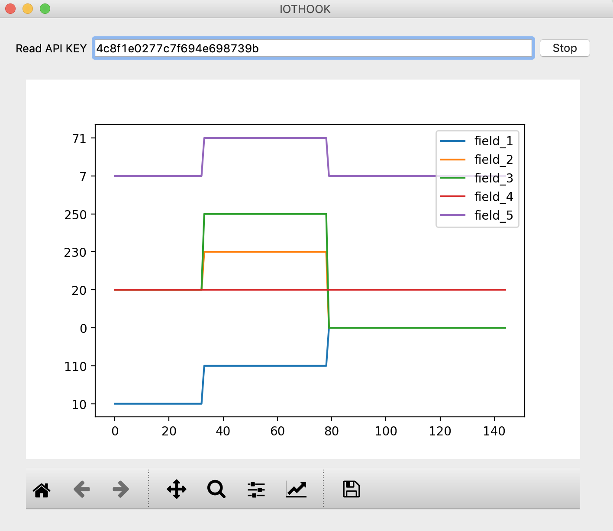

*********
Read Data
*********

We need API KEY information for retrieving the data of temperature, damp, voltage, light etc. values like that which are sending Iot device.Datas which are sending from your Iot device can monitore with mobile devices like Pi, Android, iOs or your website.

For example; Assume that our device's name "Temperature sensor" and it will be in the device additionally assume that our sensors "temperature" and "humidity"

Data Retrieving with Python 2, Python 3 Json
--------------------------------------------

Get Example with Python Json:
The number of data specified by *results* was read,by using the *requests.get* method from the IOTHOOK server
Up to 99 pieces of data can be read with the *results* variable. If the *results* variable is not specified, only 1 data can be read.
The format of readed data is *json*

The following output is obtained, by running the following Python script.

    >>> [{'id': 502483, 'device': 17, 'field_1': '46', 'field_2': '6.70', 'field_3': None, 'field_4': None, 'field_5': None, 'field_6': None, 'field_7': None, 'field_8': None, 'pub_date': '2019-08-31T00:57:27.086837', 'remote_address': '88.242.132.150&python-requests/2.12.4&HTTP/1.1'}]
    >>> 1
    >>> 502483

You can find this example and others on the `IOTHOOK Git`_ page.

.. _IOTHOOK Git: https://github.com/electrocoder/iothookdoc/tree/main/examples/

.. code-block:: python

    # -*- coding: utf-8 -*-

    """
       IoThook REST Api Test with Python 2, Python 3 

      This example is at the beginner level for sending/receiving data to the IotHook service.
      it aims to carry out tests.

      10 May 2017
      Update: 19 August 2019
      Sahin MERSIN

      For more

      http://www.iothook.com
      and
      https://github.com/electrocoder/iotHook

      go to theese sites

      For questions and support requests
      https://github.com/electrocoder/iotHook/issues
      you can take support Mese Bilisim or above github page.
      

      Broadcasting : http://mesebilisim.com

      Licensed under the Apache License, Version 2.0 (the "License").
      You may not use this file except in compliance with the License.
      A copy of the License is located at

      http://www.apache.org/licenses/

    """

    import requests

    # read api key
    API_KEY = 'ceb0024b84ff6fb7527d5506' # demo account #17 random test

    url = 'http://iothook.com/api/device/?api_key=' + API_KEY + "&results=1"

    response = requests.get(url)
    data = response.json()
    print(data)
    print(len(data))
    print(data[0]['id'])

Getting the First Data with Python 2, Python 3 Json
---------------------------------------------------

Python Getting the First Data, Get Example with Json:

You can find this example and others on the `IOTHOOK Git`_ page.

.. code-block:: python

    # -*- coding: utf-8 -*-

    """
      IoThook REST Api Test with Python 2, Python 3 

      This example is at the beginner level for sending/receiving data to the IotHook service.
      it aims to carry out tests.

      10 May 2017
      Update: 19 August 2019
      Sahin MERSIN

      For more

      http://www.iothook.com
      and
      https://github.com/electrocoder/iotHook

      go to theese sites

  
      For questions and support requests
      https://github.com/electrocoder/iotHook/issues
      you can take support Mese Bilisim or above github page.
      

      Broadcasting : http://mesebilisim.com

      Licensed under the Apache License, Version 2.0 (the "License").
      You may not use this file except in compliance with the License.
      A copy of the License is located at

      http://www.apache.org/licenses/

    """

    import requests

    # read api key
    API_KEY = '76d2628fd60903d3c1f7f8a0' # demo account #24 Temperature sensor

    url = 'https://iothook.com/api/device/?api_key=' + API_KEY + "&results=2"

    response = requests.get(url)
    data = response.json()
    print(data)
    print(data['datas'][0]['id'])
    print(data['datas'][0]['pub_date'])
    print(data['datas'][1]['id'])
    print(data['datas'][1]['pub_date'])

Getting the Last Data with Python 2, Python 3 Json
--------------------------------------------------

Python Getting the Last Data, Get Example with Json:

You can find this example and others on the `IOTHOOK Git`_ page.

.. code-block:: python

    # -*- coding: utf-8 -*-

    """
        IoThook REST Api Test with Python 2, Python 3 

      This example is at the beginner level for sending/receiving data to the IotHook service.
      it aims to carry out tests.

      10 May 2017
      Update: 19 August 2019
      Sahin MERSIN

      For more

      http://www.iothook.com
      and
      https://github.com/electrocoder/iotHook

      go to theese sites

      For questions and support requests
      https://github.com/electrocoder/iotHook/issues
      
      you can take support Mese Bilisim or above github page.
      Broadcasting : http://mesebilisim.com

      Licensed under the Apache License, Version 2.0 (the "License").
      You may not use this file except in compliance with the License.
      A copy of the License is located at

      http://www.apache.org/licenses/

    """

    import requests

    # read api key
    API_KEY = '76d2628fd60903d3c1f7f8a0' # demo account #24 Temperature sensor

    url = 'https://iothook.com/api/device/?api_key=' + API_KEY

    response = requests.get(url)
    data = response.json()
    print(data)
    print(data['datas'][0]['id'])
    print(data['datas'][0]['pub_date'])

Fetching Data in JSON Format with C#
------------------------------------

It has been produced with the GET method using Postman so that the IoThook user can use the data of his device.

You can find this example and others on the `IOTHOOK Git`_ page.

.. code-block:: c#

    /*
      Testing IoThook REST Api with C#

      In this example, device data is retrieved with CSharp with the get method.

      This example is at the beginner level for sending/receiving data to the IotHook service.
      it aims to carry out tests.

      29 July 2017
      Update: 19 August 2019
      Sahin MERSIN

      For more

      http://www.iothook.com
      and
      https://github.com/electrocoder/iotHook

      go to theese sites

      For questions and support requests
      https://github.com/electrocoder/iotHook/issues
      you can take support Mese Bilisim or above github page.

      Broadcasting : http://mesebilisim.com

      Licensed under the Apache License, Version 2.0 (the "License").
      You may not use this file except in compliance with the License.
      A copy of the License is located at

      http://www.apache.org/licenses/
    */

    // demo account #24 Temperature sensor

    var client = new RestClient("https://iothook.com/api/device/?api_key=76d2628fd60903d3c1f7f8a0&results=1");
    var request = new RestRequest(Method.GET);
    request.AddHeader("cache-control", "no-cache");
    request.AddHeader("Connection", "keep-alive");
    request.AddHeader("Accept-Encoding", "gzip, deflate");
    request.AddHeader("Host", "iothook.com");
    request.AddHeader("Postman-Token", "ce2f06c2-817e-414a-8c7a-2c2fc59ad043,af31a3d8-02e4-49eb-b78f-05ebdce70149");
    request.AddHeader("Cache-Control", "no-cache");
    request.AddHeader("Accept", "*/*");
    request.AddHeader("User-Agent", "PostmanRuntime/7.15.2");
    IRestResponse response = client.Execute(request);

IOT Data Fetching with GO
-------------------------

It has been produced with the GET method using Postman so that the IoThook user can use the data of his device.

You can find this example and others on the `IOTHOOK Git`_ page.

.. code-block:: go

    package main

    import (
        "fmt"
        "net/http"
        "io/ioutil"
    )

    func main() {

        url := "https://iothook.com/api/device/?api_key=76d2628fd60903d3c1f7f8a0&results=1"

        req, _ := http.NewRequest("GET", url, nil)

        req.Header.Add("User-Agent", "PostmanRuntime/7.15.2")
        req.Header.Add("Accept", "*/*")
        req.Header.Add("Cache-Control", "no-cache")
        req.Header.Add("Postman-Token", "ce2f06c2-817e-414a-8c7a-2c2fc59ad043,8a0938fc-5c87-459a-9b9f-fa6aebe561f2")
        req.Header.Add("Host", "iothook.com")
        req.Header.Add("Accept-Encoding", "gzip, deflate")
        req.Header.Add("Connection", "keep-alive")
        req.Header.Add("cache-control", "no-cache")

        res, _ := http.DefaultClient.Do(req)

        defer res.Body.Close()
        body, _ := ioutil.ReadAll(res.Body)

        fmt.Println(res)
        fmt.Println(string(body))

    }

IOT Data Fetching with JAVA
---------------------------

It has been produced with the GET method using Postman so that the IoThook user can use the data of his device.

You can find this example and others on the `IOTHOOK Git`_ page.

.. code-block:: java

    OkHttpClient client = new OkHttpClient();

    Request request = new Request.Builder()
      .url("https://iothook.com/api/device/?api_key=76d2628fd60903d3c1f7f8a0&results=1")
      .get()
      .addHeader("User-Agent", "PostmanRuntime/7.15.2")
      .addHeader("Accept", "*/*")
      .addHeader("Cache-Control", "no-cache")
      .addHeader("Postman-Token", "ce2f06c2-817e-414a-8c7a-2c2fc59ad043,bdcd2494-5109-4621-8256-296e0c6a4fad")
      .addHeader("Host", "iothook.com")
      .addHeader("Accept-Encoding", "gzip, deflate")
      .addHeader("Connection", "keep-alive")
      .addHeader("cache-control", "no-cache")
      .build();

    Response response = client.newCall(request).execute();

IOT Data Fetching with PHP
--------------------------

It has been produced with the GET method using Postman so that the IoThook user can use the data of his device.

You can find this example and others on the `IOTHOOK Git`_ page.

.. code-block:: php

    <?php

    $request = new HttpRequest();
    $request->setUrl('https://iothook.com/api/device/');
    $request->setMethod(HTTP_METH_GET);

    $request->setQueryData(array(
      'api_key' => '76d2628fd60903d3c1f7f8a0',
      'results' => '1'
    ));

    $request->setHeaders(array(
      'cache-control' => 'no-cache',
      'Connection' => 'keep-alive',
      'Accept-Encoding' => 'gzip, deflate',
      'Host' => 'iothook.com',
      'Postman-Token' => 'ce2f06c2-817e-414a-8c7a-2c2fc59ad043,dfad2e87-d4a1-4657-a5b6-183c4604c818',
      'Cache-Control' => 'no-cache',
      'Accept' => '*/*',
      'User-Agent' => 'PostmanRuntime/7.15.2'
    ));

    try {
      $response = $request->send();

      echo $response->getBody();
    } catch (HttpException $ex) {
      echo $ex;
    }

IOT Data Fetching with Ruby
---------------------------

It has been produced with the GET method using Postman so that the IoThook user can use the data of his device.

You can find this example and others on the `IOTHOOK Git`_ page.

.. code-block:: ruby

    require 'uri'
    require 'net/http'

    url = URI("https://iothook.com/api/device/?api_key=76d2628fd60903d3c1f7f8a0&results=1")

    http = Net::HTTP.new(url.host, url.port)

    request = Net::HTTP::Get.new(url)
    request["User-Agent"] = 'PostmanRuntime/7.15.2'
    request["Accept"] = '*/*'
    request["Cache-Control"] = 'no-cache'
    request["Postman-Token"] = 'ce2f06c2-817e-414a-8c7a-2c2fc59ad043,8fe93ff6-b857-4978-838e-2d8efac2e6b6'
    request["Host"] = 'iothook.com'
    request["Accept-Encoding"] = 'gzip, deflate'
    request["Connection"] = 'keep-alive'
    request["cache-control"] = 'no-cache'

    response = http.request(request)
    puts response.read_body

IOT Data Fetching with Javascript Ajax
--------------------------------------

It has been produced with the GET method using Postman so that the IoThook user can use the data of his device.

You can find this example and others on the `IOTHOOK Git`_ page.

.. code-block:: javascript

    var settings = {
      "async": true,
      "crossDomain": true,
      "url": "https://iothook.com/api/device/?api_key=76d2628fd60903d3c1f7f8a0&results=1",
      "method": "GET",
      "headers": {
        "User-Agent": "PostmanRuntime/7.15.2",
        "Accept": "*/*",
        "Cache-Control": "no-cache",
        "Postman-Token": "ce2f06c2-817e-414a-8c7a-2c2fc59ad043,27a5bb35-4b13-48b2-8dbd-efe7188a68c6",
        "Host": "iothook.com",
        "Accept-Encoding": "gzip, deflate",
        "Connection": "keep-alive",
        "cache-control": "no-cache"
      }
    }

    $.ajax(settings).done(function (response) {
      console.log(response);
    });

IOT Data Fetching with Python PySide2
-------------------------------------

PySide2 is the official Python module that provides access to the Qt 5.12+ framework for Python projects. Before using PySide2, the following modules need to be installed

    $ pip install matplotlib

    $ pip install numpy

    $ pip install PySide2

The installation of Python libraries has been done using pip. If pip is not installed on your system, you can visit the following address, https://bootstrap.pypa.io/get-pip.py, to download the file to your computer and run it.

Here, we will use PySide2 and Matplotlib to display the incoming data as a graph within a Window.

When the script is executed, we should see a window like the one shown below.

In this example, the interface design was created using *QT Designer*. For the widget,*Promote to ...* option was used with the *MplWidget* class. In prepearing this example *manap.se* `Manap`_ and *yapayzekalabs.blogspot.com* `Yapayzekalabs`_
used this sites. You can find more resources at these sites.

.. _Manap: https://blog.manap.se/pyqt/bolum3/plot.html
.. _Yapayzekalabs: http://yapayzekalabs.blogspot.com/2018/11/pyside2-gui-qt-designer-matplotlib.html

The test process was carried out with a device named *5 channel test* with id number *230* in IoThook.
 This device belongs to demo user

You can find this example and others on the `IOTHOOK Git`_ page.

iothook.ui folder:

.. highlight:: xml
.. literalinclude:: /../../examples/http/python/pyside2/iothook.ui
    :caption: iothook.ui

iothook.py folder:

.. highlight:: python
.. literalinclude:: /../../examples/http/python/pyside2/iothook.py
    :caption: iothook.py

